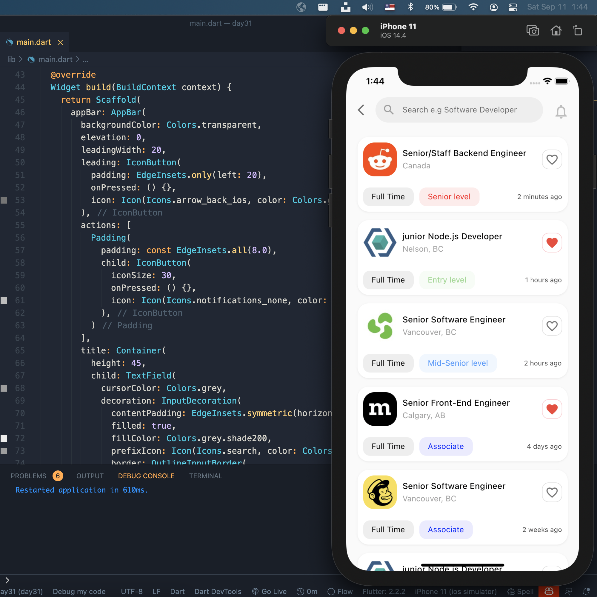

## Flutter Job List Application UI


 -'''dart
-class Afgprogrammer extends Flutter100DaysOfC
- video() {
return {
"title": "Flutter Job List Application
"description": "Let's make a Job List A
"day": 31,
ー
ー
一

 


```


## Development Setup
Clone the repository and run the following commands:
```
flutter pub get
flutter run
```

## Screenshot




